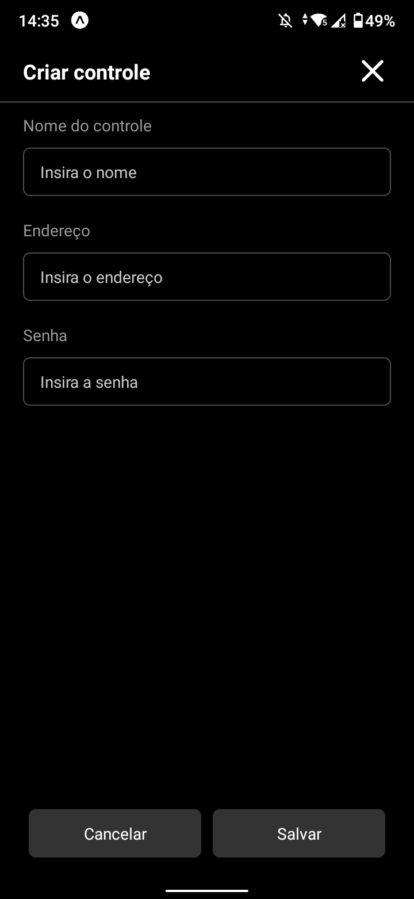
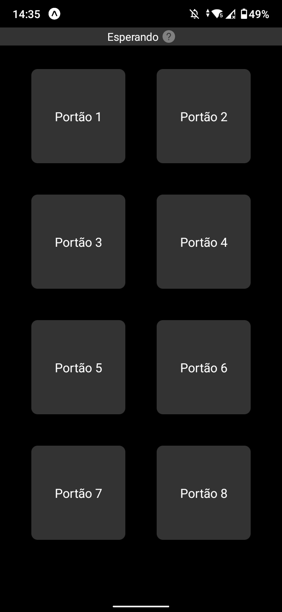

# Gate-Remote

Esse projeto usa o esp8266 para abrir portões.

## Começando

### Pré requisitos

* Arduino IDE ([Com suporte a ESP8266](http://autocorerobotica.blog.br/aprenda-configurar-ide-arduino-para-familia-esp8266/))
* Ferramenta [ESP8266 sketch Data Upload](https://github.com/esp8266/arduino-esp8266fs-plugin/releases)
* ESP8266
* Módulo de relé

### Instalando

#### ESP8266

Abra o sketch referente a sua placa em [ESP8266](ESP8266)

* Mude as configurações do seu Wi-Fi no tópico *Wi-Fi*;
* Mude as configurações dos portões no tópico *Gates & Pins*;
***

Copie os arquivos [index.html e gates.json](web) para dentro de "ESP8266/suaplaca/data".

* Altere os nomes dos portões dentro de gates.json
* Use a ferramenta ESP8266 sketch Data Upload;
* Logo após, grave o sketch no seu ESP8266;
***

#### Mobile

O aplicativo é construído com o Expo.

Execute ```npm install .``` e depois ```npm start``` para iniciar o aplicativo.

  
